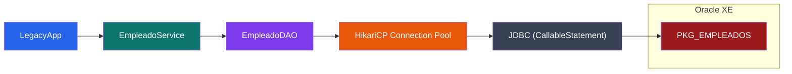

# Enterprise Java Oracle Integration

A Proof of Concept (PoC) demonstrating how a Java application integrates with legacy Oracle PL/SQL business logic through JDBC using a layered architecture, HikariCP connection pooling and modern development practices.

[](https://oracle.com/java)
[](https://maven.apache.org/)
[](https://www.oracle.com/database/)
[](https://www.docker.com/)
[](https://junit.org/junit5/)
[](https://github.com/features/actions)
[](https://opensource.org/licenses/MIT)

---

## Overview

Enterprise applications frequently centralize business logic inside Oracle PL/SQL packages instead of implementing it in the application layer.

This project reproduces that architecture by implementing a Java application that communicates with Oracle through JDBC using `CallableStatement`. The application follows a layered architecture where business logic is separated from database access through dedicated Service and DAO layers. It also incorporates HikariCP connection pooling, external configuration, logging, automated testing and continuous integration.

The objective is to provide a realistic example of Java–Oracle integration commonly found in enterprise environments.

---

## Architecture



---

## Features

- Layered architecture (Service / DAO)
- Oracle PL/SQL package integration
- JDBC communication using `CallableStatement`
- Connection pooling with HikariCP
- External configuration through `config.properties`
- Logging with Logback
- Unit testing with JUnit 5 and Mockito
- Code coverage with JaCoCo
- Continuous Integration with GitHub Actions

---

## Tech Stack

| Component | Technology |
|------------|------------|
| Language | Java 17 |
| Build Tool | Maven |
| Database | Oracle XE |
| Database Logic | Oracle PL/SQL Packages |
| Connectivity | JDBC |
| Connection Pool | HikariCP |
| Logging | Logback |
| Testing | JUnit 5 + Mockito |
| Code Coverage | JaCoCo |
| Infrastructure | Docker Compose |
| CI | GitHub Actions |

---

## Project Structure

```text
enterprise-java-oracle-integration/
├── .github/
│   └── workflows/
├── db/
│   ├── 01_create_table.sql
│   └── 02_pkg_empleados.sql
├── docker/
│   └── docker-compose.yml
├── src/
│   ├── main/
│   │   ├── java/
│   │   │   └── com/legacy/
│   │   │       ├── config/
│   │   │       ├── dao/
│   │   │       ├── exception/
│   │   │       ├── model/
│   │   │       ├── service/
│   │   │       └── LegacyApp.java
│   │   └── resources/
│   │       ├── config.properties.example
│   │       └── logback.xml
│   └── test/
│       └── java/
│           └── com/
│               └── legacy/
│                   └── service/
│                       └── EmpleadoServiceTest.java
├── pom.xml
├── .gitignore
└── README.md
```

> **Note:** `config.properties` is intentionally excluded from version control. Create it locally from `config.properties.example`.

---

## Getting Started

### Prerequisites

- Java 17 or later
- Maven
- Docker & Docker Compose

### 1. Start Oracle XE

```bash
cd docker
docker compose up -d
```

### 2. Initialize the database

Execute the SQL scripts in the following order:

1. `01_create_table.sql`
2. `02_pkg_empleados.sql`

### 3. Configure the application

Copy:

```text
src/main/resources/config.properties.example
```

to:

```text
src/main/resources/config.properties
```

Then update the Oracle database credentials.

### 4. Build the project

```bash
mvn clean install
```

### 5. Run the application

Run `LegacyApp` from your preferred IDE.

---

## Testing

Run all unit tests:

```bash
mvn test
```

Generate the JaCoCo coverage report:

```bash
mvn verify
```

---

## Continuous Integration

Every push and pull request automatically triggers a GitHub Actions workflow that:

- Builds the project
- Runs all unit tests
- Verifies that the project compiles successfully

---

## License

This project is licensed under the MIT License.

---

## Contact

**Pau López Núñez**

- Email: paulopeznunez@gmail.com
- LinkedIn: https://www.linkedin.com/in/paulopnun/
- GitHub: https://github.com/PauLopNun